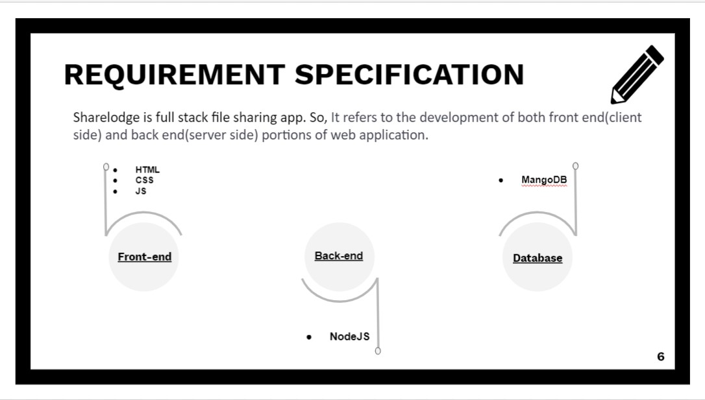
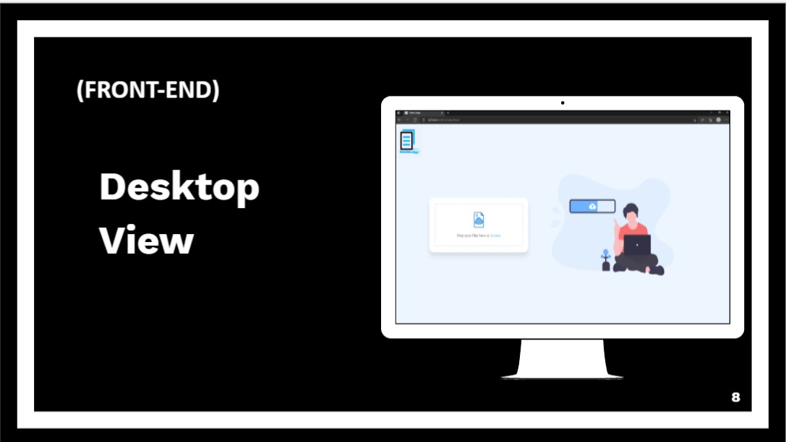
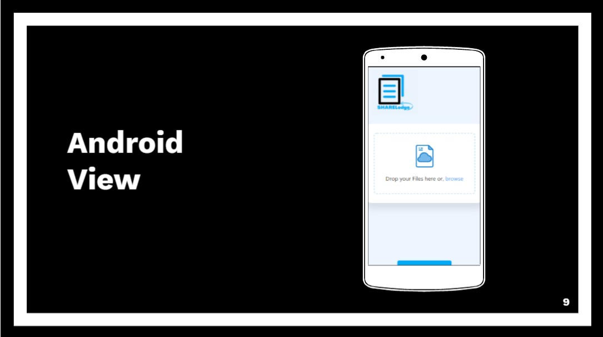

# Sharelodge - File sharing made easy and Fast

## Motivation :
The internet has made it extremely easy for anyone and everyone to share files. Whether you work for a company, work as a freelancer, or just want to share funny dog videos with friends, family, or business associates, file sharing is something everyone’s familiar with.

But sometimes we were getting annoyed by having to log in to our E-mail account on computers, we don't own just to download some attachments and it also refuses to send emails with more than 25MB of attachments, it’s hard to send large presentations, images or videos.However, there’s a workaround.  So, In the project we are trying to develop an application that requires minimum steps and also great for carrying and sharing files upto 100MB — providing people the right tools for their job.

## About this Project :

->Sharelodge is a full stack file sharing app, this app will allow users to upload files to our website and share it with a link so that other people can download it.

->It requires minimum steps and also great for carrying and sharing files upto    100MB — providing people the right tools for their job. 

->It is a file-sharing tool that eliminates all worries about sharing large files. It serves as a professional way to send large files. Using a Sharelodge makes sharing and downloading the desired piece of information easy, convenient, and instantaneous while working on a given task/project. 

->It reduces the amount of effort, time, and energy and lets one’s focus more on the performance and productivity part because It generates the own unique link after uploading the document. One can Send this link to project members via emails, documents, or any other digital communication, for downloading the document. Because generally, it’s easy and professional to email the documents to any person who’s integral to the project. 

->The user should be conveniently and instantaneously able to share files of any of supported format i.e .pdf, .doc, .tif, .png, .jpeg, .mp4 while working on a given task/project.

## Frontend of Sharelodge

